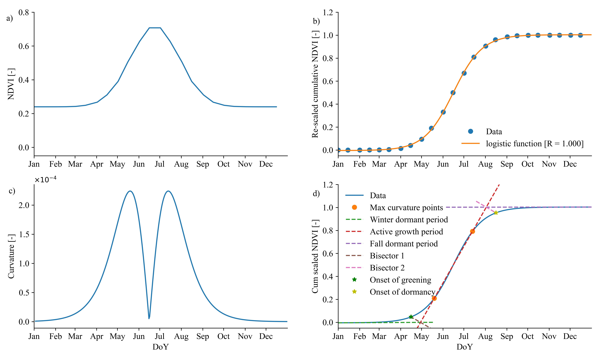
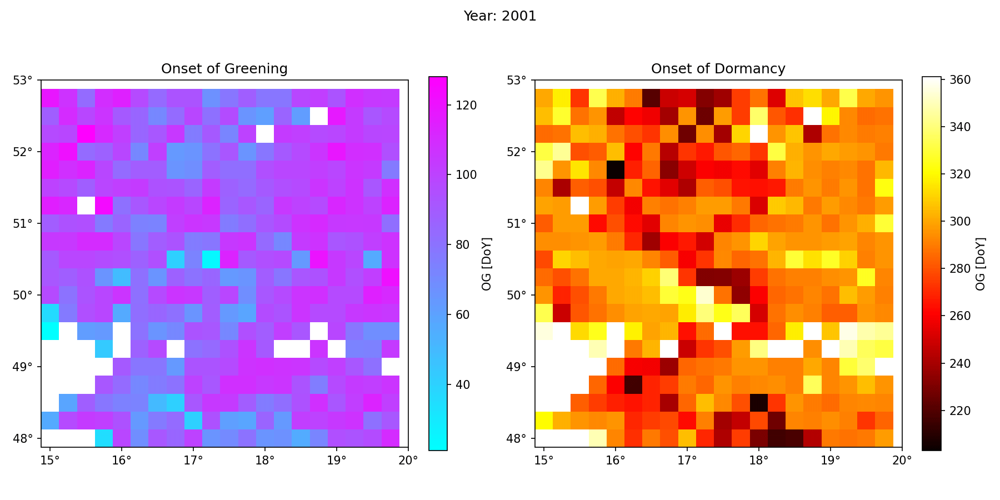

# LFD-NDVI: A logistic function derivative of NDVI to determine the onset of greening (OD) and the onset of dormancy (OD)

Welcome to the repository for the LFD-NDVI method. 
This repository contains the codes and sample data to estimate key phenological dates of different vegetation types from NDVI data along with the documentation and instructions for use.

## Overview

**Vegetation phenology** is a sensitive indicator of changes in climatic conditions. The timing of the `onset of greening (OG)` in spring and the `onset of dormancy (OD)` in the autumn are among the most important phenological events marking the `Growing Season Length (GSL)` in mid- and high-latitudes. In inferences from remote sensing, researchers, e.g., [Zhang, et al. (2003)](https://www.sciencedirect.com/science/article/pii/S0034425702001359), typically characterize the *annual cycle of vegetation phenology* by four key transition dates: `Greening`, `Maturation`, `Senescence`, and `Vegetation Dormancy`. These dates define the major phenological phases of vegetation dynamics on annual time scales. As outlined by Zhang, et al. (2003), greening is the date when photosynthetic activity begins; maturity refers to the date when the plant's green leaf area is greatest; senescence means the date when photosynthetic activity and green leaf area begin to decline rapidly; and finally, dormancy refers to the date when physiological activity approaches zero. This is true for almost all vegetation types, with only some differences in evergreen needleleaf forests. In evergreen forests dominated by conifers that retain their needles throughout the year, phenological phases are generally less pronounced than in deciduous forests ([Williams-Linera, 1997](https://www.jstor.org/stable/2997568)) as well as other vegetation types. Evergreen trees do not lose their leaves all at once like deciduous trees ([Kobayashi et al., 2018](https://www.mdpi.com/2072-4292/10/7/1071)), so there is no delineated period of leaf senescence and dormancy. Nevertheless, there are some recognizable phenological phases in evergreen forests, such as budburst (when new growth emerges from buds, as in greening of other vegetation types), active growth (which occurs throughout the year if environmental conditions such as temperature and humidity are favorable so that trees produce new needles and cones and continue to grow in height and width), and dormancy. Although evergreen trees do not lose their leaves all at once, they may enter a dormant period during the winter months when growth slows due to colder temperatures and less sunlight [(Richardson, A. D. et al. 2012)](https://onlinelibrary.wiley.com/doi/full/10.1111/j.1365-2486.2011.02562.x). Autumn dormancy in evergreen forests is a deactivation of photosynthesis6 rather than a loss of their leaves. [Yin et al. (2020)](https://agupubs.onlinelibrary.wiley.com/doi/full/10.1029/2020GL089167) note that phenological changes in evergreen forests generally occur at the photosynthetic level but can still be detected by structural and physiological vegetation indices. Our visual inspection of the NDVI curve for evergreen needleleaf forests also confirms that while the annual NDVI curve of evergreen needleleaf forests does not vary as much as other vegetation types, it still provides enough information to identify the beginning and end of the active growing season in these forests. 

The **Normalized Difference Vegetation Index (NDVI)** is a commonly used remote sensing index that measures the greenness and vegetation density of an area by analyzing the difference between the red and near-infrared bands of the electromagnetic spectrum ([Tucker, 1979](https://www.sciencedirect.com/science/article/pii/0034425779900130); [Vilhar et al., 2013](https://www.sciencedirect.com/science/article/abs/pii/B9780080982229000091)). Seasonal changes in NDVI can provide valuable information on vegetation dynamics and productivity in different vegetation types ([Pinzon & Tucker, 2014](https://www.mdpi.com/2072-4292/6/8/6929)). Pinzon and Tucker (2014) have highlighted the importance of seasonal changes in NDVI for monitoring vegetation dynamics and productivity in various types of ecosystems. Here is some information on what seasonal NDVI changes can provide in different vegetation types ([Miao et al., 2017](https://journals.plos.org/plosone/article?id=10.1371/journal.pone.0190313); [Zheng et al, 2018](https://www.sciencedirect.com/science/article/pii/S1470160X17303825?via%3Dihub); [Lobell et al., 2004](https://asu.elsevierpure.com/en/publications/cropland-distributions-from-temporal-unmixing-of-modis-data)):

**Grasslands and Savannas**: In grasslands and savannas, NDVI values are typically highest during the wet season when moisture and vegetation growth are abundant is most active. During the dry season, NDVI values typically decrease as vegetation becomes less dense and some plants become dormant or die off. Seasonal NDVI changes in grasslands and savannas can provide information on the timing and duration of the growing season, as well as the effects of drought and other environmental factors on vegetation productivity.

**Forests**: In forests, NDVI values can vary depending on the type of vegetation present. Broadleaf forests typically have higher NDVI values during the growing season when leaves are present, and lower NDVI values during the winter months when leaves have fallen. On the other hand, evergreen needleleaf forests, also known as coniferous forests, typically experience less seasonal variation in their vegetation compared to deciduous forests since their foliage is present year-round. In evergreen needleleaf forests, NDVI values tend to remain relatively stable throughout the year, with a slight increase in the growing season during spring and summer, followed by a slight decrease in the fall and winter. In total, the magnitude of this seasonal variation is generally smaller than that observed in deciduous forests. However, [Liu et al. 2016](https://www.sciencedirect.com/science/article/pii/S0034425716300219?via%3Dihub) showed that although canopy NDVI had a small dynamic range for evergreen species, they were still able to distinguish a clear pattern for NDVI enabling them to characterize the start and end of the season in evergreen forests. In general, seasonal NDVI changes in forests can provide information on the timing and duration of the growing season, as well as the effects of disturbances such as fires or logging.

**Croplands**: In croplands, NDVI values are typically highest during the growing season when crops are actively growing, and vegetation density is at its highest. NDVI values may decrease during the off-season or fallow periods and after harvest when crops are not present. Seasonal NDVI changes in croplands can provide information on growing season length, crop yield, crop health, and the effects of environmental factors such as drought or pest infestations.

**Wetlands**: In wetlands, NDVI values can vary depending on the type of vegetation present. Emergent vegetation such as cattails or reeds typically have high NDVI values during the growing season when vegetation density is highest. In contrast, submerged vegetation such as algae or seagrasses may show less seasonal variation in NDVI values. Seasonal NDVI changes in wetlands can provide information on the timing and duration of the growing season, as well as the effects of disturbances such as flooding or changes in water levels.

Overall, seasonal NDVI changes can provide valuable information on vegetation dynamics and productivity in different vegetation types, helping to monitor the health and resilience of ecosystems and inform land management decisions. For more information on the advantages and challenges of monitoring vegetation phenology stages from space, one may refer to the review paper conducted by [Ma et al., (2022)](https://onlinelibrary.wiley.com/doi/10.1111/gcb.16436).

Methods introduced in the literature that also use the NDVI data to derive OG and OD assume that bud break for a given pixel occurs at a specific NDVI threshold that is greater than the observed NDVI minimum value in winter and early spring. For example, OG is commonly defined as the day of the year when NDVI reaches the NDVI minimum plus 20% of the NDVI range ([Kang et al., 2003](https://doi.org/10.1016%2FS0034-4257%2803%2900103-2); [Shen et al., 2015](https://doi.org/10.1111%2Fgcb.12961), [Wang et al., 2018](https://doi.org/10.1111%2Fgcb.14369), [Peano et al, 2019](https://doi.org/10.1029%2F2018JG004881)) or the critical NDVI value determined from the long-term average annual curve of NDVI ([Piao et al., 2015](https://doi.org/10.1038%2Fncomms7911)). The same also applies to OD. Here, however, we introduce an innovative method that determines this critical NDVI value by cumulatively plotting NDVI. This allows us to show that the curve consisted of three parts that could be approximated linearly and that correspond to different growing periods. The critical NDVI values were then determined by calculating the intersection of the bisectors of the first two (in the case of OG) or last two (in the case of OD) lines and the cumulative curve rather than an arbitrary criterion of minimum NDVI plus 20% of the NDVI range or long-term average critical NDVI. Any remaining uncertainties in our OD and OG estimates are therefore systematic which can be important in many research where a trend analysis is planned.

Our introduced method, namely the [logistic function derivative of NDVI (LFD-NDVI) curve method](https://www.nature.com/articles/s43247-023-00890-7#MOESM1), is an innovative algorithm that could operate independently for each year and pixel. This is important because classical methods, e.g., [Piao et al., (2006)](https://doi.org/10.1111%2Fj.1365-2486.2006.01123.x), typically calculate a critical long-term NDVI value for the entire period and then determine the timing for approaching such a critical value in all individual years. The LFD-NDVI method uses the first and second derivatives of the fitted logistic function of the cumulative NDVI curve to determine OG and OD. Figure 1 provides an illustrative summary of the method:

**Figure 1**: Panel a shows the variation of NDVI over different days of the year, panel b shows the rescaled cumulative NDVI curve over different days of the year, panel c shows the variation of the curvature of the NDVI curve during different days of the year, and panel d graphically shows the calculation steps of the LFD-NDVI method for determining the onsets of greening and dormancy. DoY refers to the day of the year, although we have used the names of the months for illustrative purposes. In addition, for calculation purposes, DoY needs to be scaled to 0 and 1 [(Rahmati et al., 2023)](https://www.nature.com/articles/s43247-023-00890-7#MOESM1).

In the following, the calculation with the LFD-NDVI method is described in detail.

In the first step, a logistic function is fitted to the data (Fig. 1b):

$$ 
\begin{align}
y(t)=a+\frac{b}{1+\exp (-\frac{t-c}{d})}  \color{white}{\text{........................................}} \color{black}{\text{(1)}}
\end{align}
$$                           

where $y(t)$ is the rescaled cumulative NDVI on the day $t$ of the year, $t$ is the rescaled time (day of the year), and the model coefficients are a, b, c, and d. Using this fitted function, we obtained the smoothed curve of the rescaled cumulative NDVI data for all days of the year (t = 1:365 or 366, being scaled to 0 and 1). Third, we determined the curvature of the data, $k(t)$, for each t using the first $y′(t)$ and second $y′′(t)$ derivatives of the fitted logistic function:

$$ 
\begin{align}
k(t)=\frac{|y^{\prime\prime} (t)|}{{(1+y^{\prime} (t))}^{1.5}}  \color{white}{\text{........................................}} \color{black}{\text{(2)}}
\end{align}
$$  

Plotting $k(t)$ versus $t$ typically shows two maxima separated by a minimum. The times at which the maxima occur allow the logistic curve to be divided into three parts with nearly linear behavior (Fig. 1c). The first part occurs during the winter and early spring before the first curvature maximum in the data; we refer to this part as winter dormant period. The second part occurs between the first and second curvature maxima in the data; we refer to this part as the active growth period. Finally, the third part occurs during the late summer and falls after the second curvature maximum in the data; we refer to this part as the fall dormant period.

For the second part, a first-order polynomial function was fitted by simply using two points of maximum curvature and their respective rescaled cumulative NDVI values, plus an additional point in between. However, we used the sequential linear approximation method described by [Dathe et al, (2001)](https://doi.org/10.1016%2FS0016-7061%2801%2900077-5) to identify the linear part of the rescaled cumulative NDVI curve before the first and after the second curvature maxims. The method consists of calculating linear regressions over a consecutive number of points before the first and after the second curvature maximum. The dependence of $R^2$ on the number of data points was used to determine the number of points to be included in the regression. In this analysis, an $R^2$ value of 0.95 was used as the critical value to determine the linear parts of winter- and fall-dormant. When such an $R^2$ value was not obtained from a larger number of data, we simply used the first and last three points to draw the line in the winter- and fall-dormant periods. Next, we determined the equation of the bisector of the obtuse angle between the regression equations of the winter-dormant and active growth parts (Eq. (3)) and the fall-dormant and active growth parts (Eq. (4)) by computing the angle between two lines.

$$ 
\begin{align}
y(t) = a_{wa}t + c_{wa}  \color{white}{\text{........................................}} \color{black}{\text{(3)}}
\end{align}
$$ 

$$ 
\begin{align}
y(t) = a_{fa}t + c_{fa}  \color{white}{\text{........................................}} \color{black}{\text{(4)}}
\end{align}
$$ 

where $a_{wa}$ and $c_{wa}$ correspond to the slope and intercept of the line bisecting the lines of winter dormancy and active growth parts, and $a_{fa}$ and $c_{fa}$ correspond to the slope and intercept of the line bisecting the lines of fall dormancy and active growth parts. After determining the equations for the bisecting lines, the intersection between them and the fitted logistic function determines OG and/or OD (Fig. 1d). Mathematically, OG and OD are calculated by solving the following equations for $t$:

$$ 
\begin{align}
a_{wa}t + c_{wa} = a + \frac{b}{1+\exp (-\frac{t-c}{d})}  \color{white}{\text{........................................}} \color{black}{\text{(5)}}
\end{align}
$$ 

$$ 
\begin{align}
a_{fa}t + c_{fa} = a + \frac{b}{1+\exp (-\frac{t-c}{d})}  \color{white}{\text{........................................}} \color{black}{\text{(6)}}
\end{align}
$$

In this analysis, the `root_scalar` function of the `Optimize` sub-package of the `Python package` of `scipy` (as an alternative to the `fzero` function in `MATLAB`) was used to find a null of the above expression by changing the $t$ values.

Here is a time-lapse map of the onset of greening (OG) and the onset of the dormancy (OD), obtained by applying the LFD-NDVI method over MODIS NDVI data [2001-2020] for a small region in Europe, e.g. latitude 48.0-53.0 and longitude 15.0-20.0. 

A detailed example of the LFD-NDVI method can be found in [(Rahmati et al., 2023)](https://www.nature.com/articles/s43247-023-00890-7#MOESM1).

## Repository Structure

- **README.md**: You are here! This file provides an overview of the repository.
- **Codes**: Contains all the code related to the research project.
- **Data**: Contains datasets used in the research project.
- **Documentation**: Contains additional documentation related to the research project.
- **License**: Specifies the terms of use for the code and data.
- **environment.yml**: Specifies the required dependencies for running the code.
- **Output**: Provides main outputs of the code.

## Usage

To install the required packages, import the environment provided through the file 'environment.yml' using the following command: 'conda env create -f environment.yml'.

## License

MIT License

## References

1. Rahmati, M., Graf, A., Poppe Terán, C. et al. Continuous increase in evaporative demand shortened the growing season of European ecosystems in the last decade. Commun Earth Environ 4, 236 (2023). https://doi.org/10.1038/s43247-023-00890-7

## To be Cited:
Rahmati, M., Graf, A., Poppe Terán, C. et al. Continuous increase in evaporative demand shortened the growing season of European ecosystems in the last decade. Commun Earth Environ 4, 236 (2023). https://doi.org/10.1038/s43247-023-00890-7 

## Contact

Mehdi Rahmati
Email: mehdirmti@gmail.com
Alternative email: m.rahmati@fz-juelich.de

